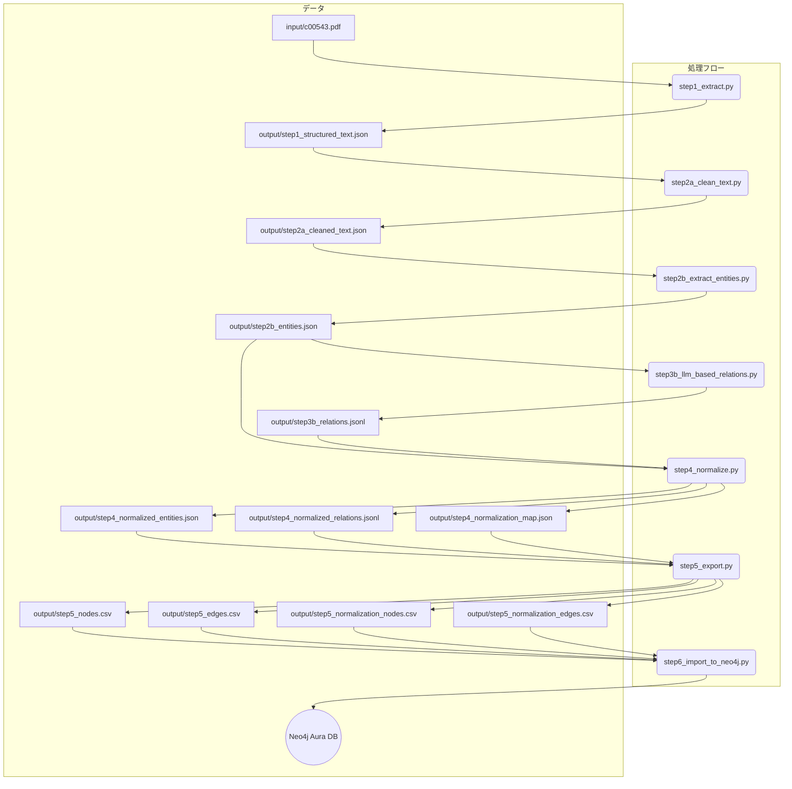

# med-graph-gen

## **はじめに**

`med-graph-gen`は、医学系PDFドキュメント（例：診療ガイドライン）を解析し、そこに含まれる専門用語（疾患、薬剤、治療法など）とその関係性を抽出して、ナレッジグラフ形式のCSVファイル（ノードリストとエッジリスト）を自動生成するツールです。

これにより、人手を介さずに、文献情報から構造化された知識データを構築することを目指します。

## **概要**

本プロジェクトは、提供されたPDFファイルから、医学用語の関連性（原因、症状、治療法など）を構造化したナレッジグラフを構築するためのCSVファイルを、人手による注釈なしで自動生成するシステムです。

ローカルでの実行環境はDockerコンテナ上に構築し、環境差異による影響を排除し、再現性を担保します。

## **プロジェクト構成**

### **ディレクトリ構造**

```
med-graph-gen/
│
├── Dockerfile
├── .env.example            # APIキー設定用のサンプルファイル
├── ... (プロンプトファイル)
│
├── input/
│   └── c00543.pdf          # 入力となるPDFファイル
│
├── output/                 # 生成された中間ファイルやCSVが格納される
│   ├── step1_structured_text.json
│   ├── step2a_cleaned_text.json
│   ├── step2b_entities.json
│   ├── step3b_relations.jsonl
│   ├── step4_normalized_entities.json
│   ├── step4_normalized_relations.jsonl
│   ├── step4_normalization_map.json
│   ├── step5_nodes.csv
│   ├── step5_edges.csv
│   ├── step5_normalization_nodes.csv
│   └── step5_normalization_edges.csv
│
└── src/                    # Pythonソースコード
    ├── main.py
    ├── step1_extract.py
    ├── step2a_clean_text.py
    ├── step2b_extract_entities.py
    ├── step3b_llm_based_relations.py
    ├── step4_normalize.py
    └── step5_export.py
```

### **処理フロー**



## **実装ステップ**

### **ステップ1: テキスト抽出 (step1_extract.py)**
*   **目的:** PDFから指定されたページ範囲のテキストを抽出します。`--start_page`と`--end_page`引数で範囲を指定できます。
*   **出力:** `output/step1_structured_text.json`

### **ステップ2a: テキストクレンジングと段落化 (step2a_clean_text.py)**
*   **目的:** LLMを用いて、抽出したテキストから不要な情報を取り除き、段落単位に分割します。APIレート制限対策として`--wait`引数で待機時間を指定できます。
*   **出力:** `output/step2a_cleaned_text.json`

### **ステップ2b: LLMによるエンティティ抽出 (step2b_extract_entities.py)**
*   **目的:** クレンジングされた段落から、LLMを用いて医学用語（エンティティ）を抽出します。
*   **出力:** `output/step2b_entities.json`

### **ステップ3b: LLMベースのリレーション抽出 (step3b_llm_based_relations.py)**
*   **目的:** 段落内のエンティティのペアに基づき、LLMを用いてそれらの関係性を抽出します。
*   **出力:** `output/step3b_relations.jsonl`

### **ステップ4: ナレッジの正規化 (step4_normalize.py)**
*   **目的:** 抽出したエンティティの表記ゆれ（例: `非歯原性歯痛`と`NTDP`）を統一します。
*   **出力:** `output/step4_normalized_entities.json`, `output/step4_normalized_relations.jsonl`, `output/step4_normalization_map.json`

### **ステップ5: CSVへのエクスポート (step5_export.py)**
*   **目的:** 正規化されたエンティティとリレーションを、グラフデータベースで扱いやすいCSV形式に変換します。この際、リレーション名を`skos`や`biolink`などの標準的なオントロジー語彙にマッピングし、データの相互運用性を高めます。また、正規化の対応関係そのものもグラフとしてCSV出力します。
*   **出力:** 
    *   `output/step5_nodes.csv`, `output/step5_edges.csv` (ナレッジグラフ)
    *   `output/step5_normalization_nodes.csv`, `output/step5_normalization_edges.csv` (正規化関係グラフ)

### **ステップ6: Neo4jへのインポート (step6_import_to_neo4j.py)**
*   **目的:** ステップ5で生成された4つのCSVファイルをNeo4j Aura DBにインポートし、グラフを構築します。
*   **入力:** `output/step5_*.csv`
*   **処理:** 環境変数で指定された接続情報に基づき、Neo4jデータベースに接続し、CSVデータを元にノードとリレーションを作成します。

## **前提条件**

*   [Docker](https://www.docker.com/) がインストールされていること。
*   Gemini APIキーが取得済みであること。
*   Neo4j Aura DBのアカウントが準備済みで、接続情報（URI, ユーザー名, パスワード）が取得済みであること。

## **実行手順**

1.  **環境変数の設定:**
    プロジェクトのルートディレクトリに `.env` ファイルを作成し、各種キー情報を記述します。
    ```
    GEMINI_API_KEY="<YOUR_API_KEY>"
    NEO4J_URI="<YOUR_NEO4J_AURA_URI>"
    NEO4J_USER="<YOUR_NEO4J_USER>"
    NEO4J_PASSWORD="<YOUR_NEO4J_PASSWORD>"
    ```

2.  **Dockerイメージのビルド:**
```

## **実装ステップ**

### **ステップ1: テキスト抽出 (step1_extract.py)**
*   **目的:** PDFから指定されたページ範囲のテキストを抽出します。`--start_page`と`--end_page`引数で範囲を指定できます。
*   **出力:** `output/step1_structured_text.json`

### **ステップ2a: テキストクレンジングと段落化 (step2a_clean_text.py)**
*   **目的:** LLMを用いて、抽出したテキストから不要な情報を取り除き、段落単位に分割します。APIレート制限対策として`--wait`引数で待機時間を指定できます。
*   **出力:** `output/step2a_cleaned_text.json`

### **ステップ2b: LLMによるエンティティ抽出 (step2b_extract_entities.py)**
*   **目的:** クレンジングされた段落から、LLMを用いて医学用語（エンティティ）を抽出します。
*   **出力:** `output/step2b_entities.json`

### **ステップ3b: LLMベースのリレーション抽出 (step3b_llm_based_relations.py)**
*   **目的:** 段落内のエンティティのペアに基づき、LLMを用いてそれらの関係性を抽出します。
*   **出力:** `output/step3b_relations.jsonl`

### **ステップ4: ナレッジの正規化 (step4_normalize.py)**
*   **目的:** 抽出したエンティティの表記ゆれ（例: `非歯原性歯痛`と`NTDP`）を統一します。
*   **出力:** `output/step4_normalized_entities.json`, `output/step4_normalized_relations.jsonl`, `output/step4_normalization_map.json`

### **ステップ5: CSVへのエクスポート (step5_export.py)**
*   **目的:** 正規化されたエンティティとリレーションを、グラフデータベースで扱いやすいCSV形式に変換します。この際、リレーション名を`skos`や`biolink`などの標準的なオントロジー語彙にマッピングし、データの相互運用性を高めます。また、正規化の対応関係そのものもグラフとしてCSV出力します。
*   **出力:** 
    *   `output/step5_nodes.csv`, `output/step5_edges.csv` (ナレッジグラフ)
    *   `output/step5_normalization_nodes.csv`, `output/step5_normalization_edges.csv` (正規化関係グラフ)

## **前提条件**

*   [Docker](https://www.docker.com/) がインストールされていること。
*   Gemini APIキーが取得済みであること。

## **実行手順**

1.  **Gemini APIキーの設定:**
    プロジェクトのルートディレクトリに `.env` ファイルを作成し、お持ちのAPIキーを記述します。
    ```
    GEMINI_API_KEY="<YOUR_API_KEY>"
    ```

2.  **Dockerイメージのビルド:**
    ```bash
    docker build -t knowledge-graph-builder .
    ```

3.  **Dockerコンテナの実行:**
    *   **全ステップを実行 (推奨):**
        ```bash
        docker run --rm --env-file .env \
          -v "$(pwd)/output:/app/output" \
          -v "$(pwd)/input:/app/input" \
          -v "$(pwd)/paragraph_cleaning_prompt.md:/app/paragraph_cleaning_prompt.md" \
          -v "$(pwd)/entity_extraction_prompt.md:/app/entity_extraction_prompt.md" \
          -v "$(pwd)/relation_extraction_batch_prompt.md:/app/relation_extraction_batch_prompt.md" \
          -v "$(pwd)/entity_normalization_prompt.md:/app/entity_normalization_prompt.md" \
          knowledge-graph-builder python -u -m src.main
        ```
        *注意: `$(pwd)` は現在のディレクトリの絶対パスに展開されます。お使いのシェル環境によっては、`/path/to/your/med-graph-gen` のように手動で絶対パスを指定する必要がある場合があります.*

    *   **ページ範囲と待機時間を指定して実行:**
        `--start_page`, `--end_page`, `--wait` 引数で、処理対象のページ範囲とAPI呼び出し間の待機時間（秒）を制御できます。
        ```bash
docker run --rm --env-file .env \
  -v "$(pwd)/output:/app/output" \
  -v "$(pwd)/input:/app/input" \
  -v "$(pwd)/paragraph_cleaning_prompt.md:/app/paragraph_cleaning_prompt.md" \
  -v "$(pwd)/entity_extraction_prompt.md:/app/entity_extraction_prompt.md" \
  -v "$(pwd)/relation_extraction_batch_prompt.md:/app/relation_extraction_batch_prompt.md" \
  -v "$(pwd)/entity_normalization_prompt.md:/app/entity_normalization_prompt.md" \
  knowledge-graph-builder python -u -m src.main --start_page 12 --end_page 17 --wait 5

## **生成されるCSVの例**

**output/step5_nodes.csv**

```csv
NodeID,Label,Category
DISEASE_001,非歯原性歯痛,疾患
...
```

**output/step5_edges.csv**

```csv
SourceID,TargetID,Relation,DataSource
DISEASE_001,DISEASE_002,biolink:is_symptom_of,c00543.pdf_p12
...
```

**output/step5_normalization_nodes.csv**

```csv
NodeID,Label
TERM_0001,非歯原性歯痛
TERM_0002,NTDP
...
```

**output/step5_normalization_edges.csv**

```csv
SourceID,TargetID,Relation
TERM_0002,TERM_0001,skos:exactMatch
...
```