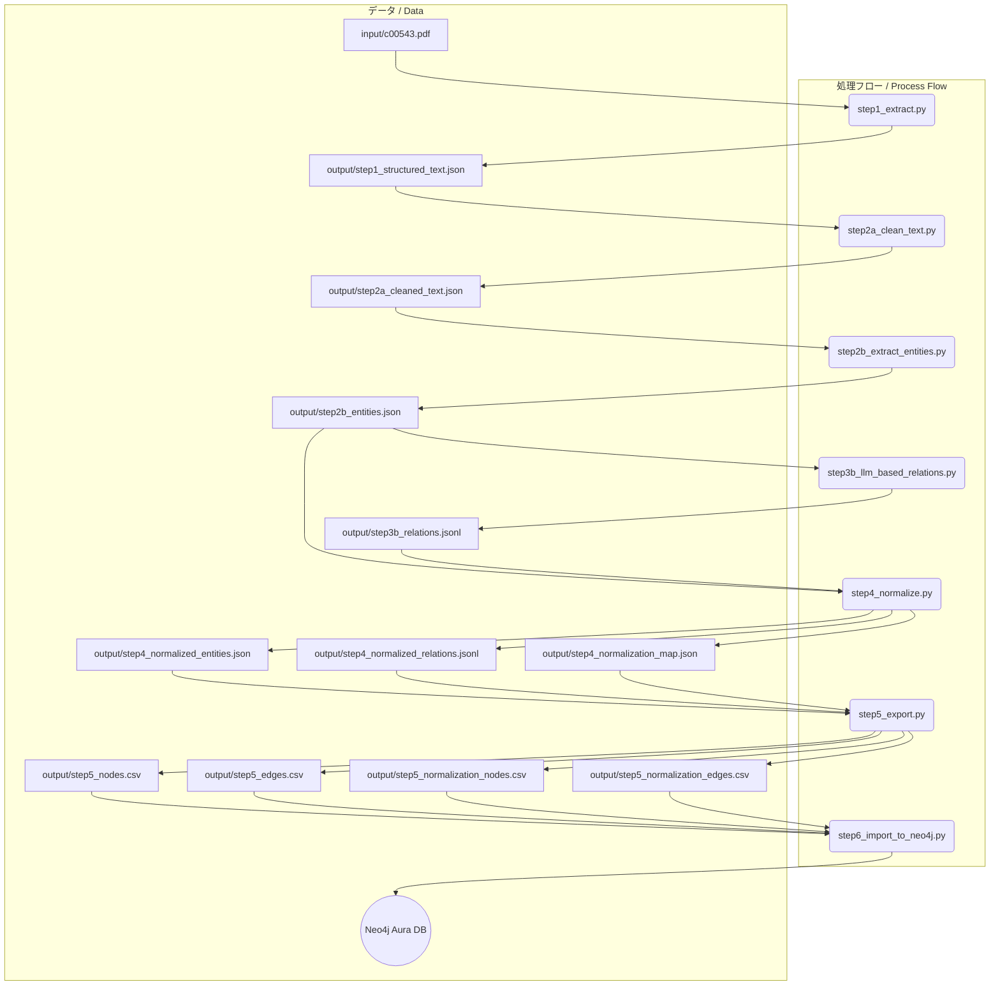

# med-graph-gen

## **はじめに** / Introduction

`med-graph-gen`は、医学系PDFドキュメント（例：診療ガイドライン）を解析し、そこに含まれる専門用語（疾患、薬剤、治療法など）とその関係性を抽出して、ナレッジグラフ形式のCSVファイル（ノードリストとエッジリスト）を自動生成するツールです。  
`med-graph-gen` is a tool that analyzes medical PDF documents (e.g., clinical guidelines), extracts specialized terms (such as diseases, drugs, and treatments) and their relationships, and automatically generates knowledge graph CSV files (node and edge lists).

これにより、人手を介さずに、文献情報から構造化された知識データを構築することを目指します。  
The goal is to build structured knowledge data from literature information without manual intervention.

本プロジェクトは日本口腔顔面痛学会によって作成された、非歯原性歯痛の診療ガイドライン 改訂版を基に検証、作成されています。各プロンプトは当該ガイドラインをパースするべく記載されていますので、他の医学系ドキュメントを処理される場合はその資料に合わせた修正を検討ください。  
This project has been verified and created based on the revised clinical guidelines for non-odontogenic toothache created by the Japanese Society of Orofacial Pain. The prompts are designed to parse these specific guidelines, so if you are processing other medical documents, please consider modifying them to suit the new material.

## **ライセンス** / License

本プロジェクトのライセンスはGNU General Public License v3.0としていますが、取り扱うPDFおよびその出力産物についてはその範疇では有りません。出力ファイルの取扱は、PDFファイルの発行元にご確認ください。  
The license for this project is the GNU General Public License v3.0, but this does not cover the processed PDFs and their outputs. Please check with the publisher of the PDF file regarding the handling of the output files.

## **概要** / Overview

本プロジェクトは、提供されたPDFファイルから、医学用語の関連性（原因、症状、治療法など）を構造化したナレッジグラフを構築するためのCSVファイルを、人手による注釈なしで自動生成するシステムです。  
This project is a system that automatically generates CSV files for building a structured knowledge graph of medical term relationships (such as causes, symptoms, and treatments) from a provided PDF file, without manual annotation.

ローカルでの実行環境はDockerコンテナ上に構築し、環境差異による影響を排除し、再現性を担保します。  
The local execution environment is built on a Docker container to eliminate the effects of environmental differences and ensure reproducibility.

## **プロジェクト構成** / Project Structure

### **ディレクトリ構造** / Directory Structure

```
med-graph-gen/
│
├── Dockerfile
├── .env.example            # APIキー設定用のサンプルファイル / Sample file for API key settings
├── ... (プロンプトファイル)
│
├── input/
│   └── c00543.pdf          # 入力となるPDFファイル / Input PDF file
│
├── output/                 # 生成された中間ファイルやCSVが格納される / Directory for intermediate files and CSVs
│   ├── step1_structured_text.json
│   ├── step2a_cleaned_text.json
│   ├── step2b_entities.json
│   ├── step3b_relations.jsonl
│   ├── step4_normalized_entities.json
│   ├── step4_normalized_relations.jsonl
│   ├── step4_normalization_map.json
│   ├── step5_nodes.csv
│   ├── step5_edges.csv
│   ├── step5_normalization_nodes.csv
│   └── step5_normalization_edges.csv
│
└── src/                    # Pythonソースコード / Python source code
    ├── main.py
    ├── step1_extract.py
    ├── step2a_clean_text.py
    ├── step2b_extract_entities.py
    ├── step3b_llm_based_relations.py
    ├── step4_normalize.py
    └── step5_export.py
```

### **処理フロー** / Processing Flow



## **実装ステップ** / Implementation Steps

### **ステップ1: テキスト抽出 (step1_extract.py)** / Step 1: Text Extraction (step1_extract.py)
*   **目的:** PDFから指定されたページ範囲のテキストを抽出します。`--start_page`と`--end_page`引数で範囲を指定できます。
    *   **Objective:** Extracts text from a specified page range of a PDF. The range can be specified with the `--start_page` and `--end_page` arguments.
*   **出力:** `output/step1_structured_text.json`
    *   **Output:** `output/step1_structured_text.json`

### **ステップ2a: テキストクレンジングと段落化 (step2a_clean_text.py)** / Step 2a: Text Cleansing and Paragraph Segmentation (step2a_clean_text.py)
*   **目的:** LLMを用いて、抽出したテキストから不要な情報を取り除き、段落単位に分割します。APIレート制限対策として`--wait`引数で待機時間を指定できます。
    *   **Objective:** Uses an LLM to remove unnecessary information from the extracted text and segment it into paragraphs. The `--wait` argument can be used to specify a waiting time to avoid API rate limiting.
*   **出力:** `output/step2a_cleaned_text.json`
    *   **Output:** `output/step2a_cleaned_text.json`

### **ステップ2b: LLMによるエンティティ抽出 (step2b_extract_entities.py)** / Step 2b: Entity Extraction with LLM (step2b_extract_entities.py)
*   **目的:** クレンジングされた段落から、LLMを用いて医学用語（エンティティ）を抽出します。
    *   **Objective:** Extracts medical terms (entities) from the cleansed paragraphs using an LLM.
*   **出力:** `output/step2b_entities.json`
    *   **Output:** `output/step2b_entities.json`

### **ステップ3b: LLMベースのリレーション抽出 (step3b_llm_based_relations.py)** / Step 3b: LLM-based Relation Extraction (step3b_llm_based_relations.py)
*   **目的:** 段落内のエンティティのペアに基づき、LLMを用いてそれらの関係性を抽出します。
    *   **Objective:** Extracts relationships between pairs of entities within a paragraph using an LLM.
*   **出力:** `output/step3b_relations.jsonl`
    *   **Output:** `output/step3b_relations.jsonl`

### **ステップ4: ナレッジの正規化 (step4_normalize.py)** / Step 4: Knowledge Normalization (step4_normalize.py)
*   **目的:** 抽出したエンティティの表記ゆれ（例: `非歯原性歯痛`と`NTDP`）を統一します。
    *   **Objective:** Unifies different notations of extracted entities (e.g., `非歯原性歯痛` and `NTDP`).
*   **出力:** `output/step4_normalized_entities.json`, `output/step4_normalized_relations.jsonl`, `output/step4_normalization_map.json`
    *   **Output:** `output/step4_normalized_entities.json`, `output/step4_normalized_relations.jsonl`, `output/step4_normalization_map.json`

### **ステップ5: CSVへのエクスポート (step5_export.py)** / Step 5: Export to CSV (step5_export.py)
*   **目的:** 正規化されたエンティティとリレーションを、グラフデータベースで扱いやすいCSV形式に変換します。この際、リレーション名を`skos`や`biolink`などの標準的なオントロジー語彙にマッピングし、データの相互運用性を高めます。また、正規化の対応関係そのものもグラフとしてCSV出力します。
    *   **Objective:** Converts normalized entities and relations into a CSV format that is easy to handle in a graph database. During this process, relation names are mapped to standard ontology vocabularies like `skos` and `biolink` to enhance data interoperability. The normalization map itself is also exported as a graph in CSV format.
*   **出力:** 
    *   `output/step5_nodes.csv`, `output/step5_edges.csv` (ナレッジグラフ / Knowledge Graph)
    *   `output/step5_normalization_nodes.csv`, `output/step5_normalization_edges.csv` (正規化関係グラフ / Normalization Relationship Graph)
*   **Output:** 
    *   `output/step5_nodes.csv`, `output/step5_edges.csv` (Knowledge Graph)
    *   `output/step5_normalization_nodes.csv`, `output/step5_normalization_edges.csv` (Normalization Relationship Graph)

### **ステップ6: Neo4jへのインポート (step6_import_to_neo4j.py)** / Step 6: Import to Neo4j (step6_import_to_neo4j.py)
*   **目的:** ステップ5で生成された4つのCSVファイルをNeo4j Aura DBにインポートし、グラフを構築します。
    *   **Objective:** Imports the four CSV files generated in Step 5 into a Neo4j Aura DB to build the graph.
*   **入力:** `output/step5_*.csv`
    *   **Input:** `output/step5_*.csv`
*   **処理:** 環境変数で指定された接続情報に基づき、Neo4jデータベースに接続し、CSVデータを元にノードとリレーションを作成します。
    *   **Process:** Connects to the Neo4j database based on the connection information specified in the environment variables and creates nodes and relationships from the CSV data.

## **前提条件** / Prerequisites

*   [Docker](https.www.docker.com/) がインストールされていること。
    *   [Docker](https.www.docker.com/) is installed.
*   Gemini APIキーが取得済みであること。
    *   A Gemini API key has been obtained.
*   Neo4j Aura DBのアカウントが準備済みで、接続情報（URI, ユーザー名, パスワード）が取得済みであること。
    *   A Neo4j Aura DB account is set up, and the connection information (URI, username, password) has been obtained.

## **実行手順** / Execution Steps

1.  **レポジトリクローン:** / **Clone the repository:**
    ```
    git clone https://github.com/fk506cni/med-graph-gen    
    ```

2.  **環境変数の設定:** / **Set up environment variables:**
    プロジェクトのルートディレクトリに `.env` ファイルを作成し、各種キー情報を記述します。
    Create a `.env` file in the project root directory and write the necessary key information.
    ```
    GEMINI_API_KEY="<YOUR_API_KEY>"
    NEO4J_URI="<YOUR_NEO4J_AURA_URI>"
    NEO4J_USER="<YOUR_NEO4J_USER>"
    NEO4J_PASSWORD="<YOUR_NEO4J_PASSWORD>"
    ```

3.  **Dockerイメージのビルド:** / **Build the Docker image:**
    ```bash
    docker build -t knowledge-graph-builder .
    ```
    
4.  **Dockerコンテナの実行:** / **Run the Docker container:**
    *   **全ステップを実行 (推奨):** / **Run all steps (Recommended):**
        ```bash
        docker run --rm --env-file .env \
          -v "$(pwd)/output:/app/output" \
          -v "$(pwd)/input:/app/input" \
          -v "$(pwd)/paragraph_cleaning_prompt.md:/app/paragraph_cleaning_prompt.md" \
          -v "$(pwd)/entity_extraction_prompt.md:/app/entity_extraction_prompt.md" \
          -v "$(pwd)/relation_extraction_batch_prompt.md:/app/relation_extraction_batch_prompt.md" \
          -v "$(pwd)/entity_normalization_prompt.md:/app/entity_normalization_prompt.md" \
          knowledge-graph-builder python -u -m src.main
        ```
        *注意: `$(pwd)` は現在のディレクトリの絶対パスに展開されます。お使いのシェル環境によっては、`/path/to/your/med-graph-gen` のように手動で絶対パスを指定する必要がある場合があります.*
        *Note: `$(pwd)` expands to the absolute path of the current directory. Depending on your shell environment, you may need to manually specify the absolute path, such as `/path/to/your/med-graph-gen`.*

    *   **ページ範囲や実行ステップを指定して実行:** / **Run with specified page range and execution steps:**
        `--start_page`, `--end_page` で処理対象のページ範囲を、`--wait` でAPI呼び出し間の待機時間（秒）を、`--start-step`, `--end-step` で実行する処理の範囲を制御できます。
        You can control the processing page range with `--start_page` and `--end_page`, the waiting time (in seconds) between API calls with `--wait`, and the range of processing steps with `--start-step` and `--end-step`.
        `--wait`でLLMへの処理Wait時間を制御できます。60を設定することで1日の実行回数は1440ぐらいになるので、gemini-1.5-flashの無料枠内に収まるはずです。
        The `--wait` argument controls the waiting time for LLM processing. Setting it to 60 will result in about 1440 executions per day, which should stay within the free tier of gemini-1.5-flash.
        
        ```bash
        docker run --rm --env-file .env \
        -v "$(pwd)/output:/app/output" \
        -v "$(pwd)/input:/app/input" \
        -v "$(pwd)/paragraph_cleaning_prompt.md:/app/paragraph_cleaning_prompt.md" \
        -v "$(pwd)/entity_extraction_prompt.md:/app/entity_extraction_prompt.md" \
        -v "$(pwd)/relation_extraction_batch_prompt.md:/app/relation_extraction_batch_prompt.md" \
        -v "$(pwd)/entity_normalization_prompt.md:/app/entity_normalization_prompt.md" \
        knowledge-graph-builder python -u -m src.main --start_page 12 --end_page 17 --wait 5 --start-step step2a --end-step step4
        ```
        *注意: `--start-step` のみ指定した場合はそのステップから最後まで、`--end-step` のみ指定した場合は最初からそのステップまで実行されます。*
        *Note: If only `--start-step` is specified, the process will run from that step to the end. If only `--end-step` is specified, the process will run from the beginning to that step.*


## **生成されるCSVの例** / Example of Generated CSV

**output/step5_nodes.csv**

```csv
NodeID,Label,Category
DISEASE_001,非歯原性歯痛,疾患
...
```

**output/step5_edges.csv**

```csv
SourceID,TargetID,Relation,DataSource
DISEASE_001,DISEASE_002,biolink:is_symptom_of,c00543.pdf_p12
...
```

**output/step5_normalization_nodes.csv**

```csv
NodeID,Label
TERM_0001,非歯原性歯痛
TERM_0002,NTDP
...
```

**output/step5_normalization_edges.csv**

```csv
SourceID,TargetID,Relation
TERM_0002,TERM_0001,skos:exactMatch
...
```