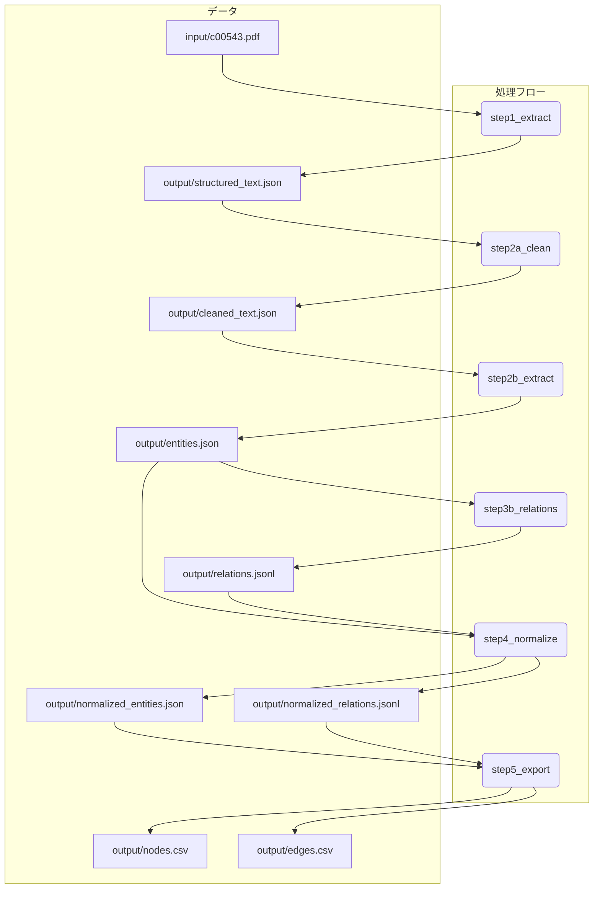

# med-graph-gen

## **はじめに**

`med-graph-gen`は、医学系PDFドキュメント（例：診療ガイドライン）を解析し、そこに含まれる専門用語（疾患、薬剤、治療法など）とその関係性を抽出して、ナレッジグラフ形式のCSVファイル（ノードリストとエッジリスト）を自動生成するツールです。

これにより、人手を介さずに、文献情報から構造化された知識データを構築することを目指します。

## **概要**

本プロジェクトは、提供されたPDFファイルから、医学用語の関連性（原因、症状、治療法など）を構造化したナレッジグラフを構築するためのCSVファイルを、人手による注釈なしで自動生成するシステムです。

ローカルでの実行環境はDockerコンテナ上に構築し、環境差異による影響を排除し、再現性を担保します。

## **プロジェクト構成**

### **ディレクトリ構造**

```
med-graph-gen/
│
├── Dockerfile
├── .env.example            # APIキー設定用のサンプルファイル
├── entity_normalization_prompt.md
├── relation_extraction_batch_prompt.md
├── ... (その他プロンプトファイル)
│
├── input/
│   └── c00543.pdf          # 入力となるPDFファイル
│
├── output/                 # 生成された中間ファイルやCSVが格納される
│   ├── nodes.csv
│   └── edges.csv
│
└── src/                    # Pythonソースコード
    ├── main.py
    ├── step1_extract.py
    ├── step2a_clean_text.py
    ├── step2b_extract_entities.py
    ├── step3b_llm_based_relations.py
    ├── step4_normalize.py
    └── step5_export.py
```

### **処理フロー**



## **実装ステップ**

### **ステップ1: テキスト抽出 (step1_extract.py)**
*   **目的:** PDFから指定されたページ範囲のテキストを抽出します。
*   **出力:** `output/structured_text.json`

### **ステップ2a: テキストクレンジングと段落化 (step2a_clean_text.py)**
*   **目的:** LLMを用いて、抽出したテキストからヘッダーやフッターなどの不要な情報を取り除き、内容を段落単位に分割します。
*   **出力:** `output/cleaned_text.json`

### **ステップ2b: LLMによるエンティティ抽出 (step2b_extract_entities.py)**
*   **目的:** クレンジングされた段落から、LLMを用いて医学用語（エンティティ）を抽出します。
*   **出力:** `output/entities.json`

### **ステップ3b: LLMベースのリレーション抽出 (step3b_llm_based_relations.py)**
*   **目的:** 段落内のエンティティのペアに基づき、LLMを用いてそれらの関係性を抽出します。
*   **出力:** `output/relations.jsonl`

### **ステップ4: ナレッジの正規化 (step4_normalize.py)**
*   **目的:** 抽出したエンティティの表記ゆれ（例: `非歯原性歯痛`と`NTDP`）を統一します。
*   **処理フロー:**
    1.  `output/entities.json` を読み込み、エンティティのリストをバッチに分割します。
    2.  各バッチをLLMに送信し、正規化名の候補を取得します。
    3.  全バッチの候補を集計し、最も頻度の高いものを「代表名」として決定する多数決ロジックにより、最終的な正規化マッピングを作成します。
    4.  このマッピングを用いて、エンティティとリレーションの表記を統一します。
*   **出力:** `output/normalized_entities.json`, `output/normalized_relations.jsonl`, `output/normalization_map.json`

### **ステップ5: CSVへのエクスポート (step5_export.py)**
*   **目的:** 正規化されたエンティティとリレーションを、グラフデータベースで扱いやすいCSV形式に変換します。
*   **処理フロー:**
    1.  正規化済みのエンティティとリレーションのファイルを読み込みます。
    2.  各エンティティにユニークなID（例: `DISEASE_001`）を付与し、`nodes.csv` を生成します。
    3.  リレーション情報内のエンティティ名を対応するIDに置換し、`edges.csv` を生成します。
*   **出力:** `output/nodes.csv`, `output/edges.csv`

## **前提条件**

*   [Docker](https://www.docker.com/) がインストールされていること。
*   Gemini APIキーが取得済みであること。

## **実行手順**

1.  **Gemini APIキーの設定:**
    プロジェクトのルートディレクトリに `.env` ファイルを作成し、お持ちのAPIキーを記述します。
    ```
    GEMINI_API_KEY="<YOUR_API_KEY>"
    ```

2.  **Dockerイメージのビルド:**
    ```bash
    docker build -t knowledge-graph-builder .
    ```

3.  **Dockerコンテナの実行:**
    *   **全ステップを実行:**
        以下のコマンドは、`output`ディレクトリと、LLMへの指示に必要な全てのプロンプトファイルをコンテナにマウントし、パイプライン全体を実行します。
        ```bash
        docker run --rm --env-file .env \
          -v "$(pwd)/output:/app/output" \
          -v "$(pwd)/paragraph_cleaning_prompt.md:/app/paragraph_cleaning_prompt.md" \
          -v "$(pwd)/entity_extraction_prompt.md:/app/entity_extraction_prompt.md" \
          -v "$(pwd)/relation_extraction_batch_prompt.md:/app/relation_extraction_batch_prompt.md" \
          -v "$(pwd)/entity_normalization_prompt.md:/app/entity_normalization_prompt.md" \
          knowledge-graph-builder python -u src/main.py
        ```

    *   **特定のステップから実行:**
        `--start-step`引数で開始ステップを指定できます。（例: `step5`から開始）
        ```bash
        docker run --rm --env-file .env \
          -v "$(pwd)/output:/app/output" \
          -v "$(pwd)/entity_normalization_prompt.md:/app/entity_normalization_prompt.md" \
          knowledge-graph-builder python -u src/main.py --start-step step5
        ```
        *注意: 開始するステップによっては、依存するプロンプトファイルのマウントが別途必要になる場合があります。*

    実行が完了すると、ローカルの `output` ディレクトリに中間ファイルや最終的なCSVが生成されます。

## **生成されるCSVの例**

**output/nodes.csv**

```csv
NodeID,Label,Category
DISEASE_001,非歯原性歯痛,疾患
DISEASE_002,筋・筋膜痛,疾患
DRUG_001,カルバマゼピン,薬剤
TREATMENT_001,抜髄,治療法
```

**output/edges.csv**

```csv
SourceID,TargetID,Relation,DataSource
DISEASE_001,DISEASE_002,has_underlying_disease,c00543.pdf_p12
DRUG_001,DISEASE_001,is_effective_for,c00543.pdf_p40
TREATTMENT_001,DISEASE_001,is_not_effective_for,c00543.pdf_p49
```