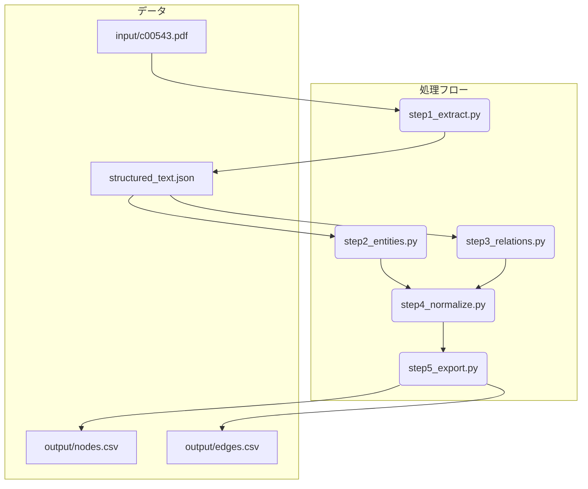

# med-graph-gen

## **はじめに**

`med-graph-gen`は、医学系PDFドキュメント（例：診療ガイドライン）を解析し、そこに含まれる専門用語（疾患、薬剤、治療法など）とその関係性を抽出して、ナレッジグラフ形式のCSVファイル（ノードリストとエッジリスト）を自動生成するツールです。

これにより、人手を介さずに、文献情報から構造化された知識データを構築することを目指します。

## **概要**

本プロジェクトは、提供されたPDFファイル『非歯原性歯痛の診療ガイドライン』から、医学用語の関連性（原因、症状、治療法など）を構造化したナレッジグラフを構築するためのCSVファイルを、人手による注釈なしで自動生成するシステムの実装計画を定義します。

ローカルでの実行環境はDockerコンテナ上に構築し、環境差異による影響を排除し、再現性を担保します。

## **プロジェクト構成**

### **ディレクトリ構造**

```
med-graph-gen/
│
├── build/                  # Dockerビルド関連のファイルを格納
│   ├── Dockerfile
│   └── requirements.txt
│
├── input/
│   └── c00543.pdf          # 入力となるPDFファイル
│
├── output/                 # 生成されたCSVファイルが格納される
│   ├── nodes.csv
│   └── edges.csv
│
└── src/                    # Pythonソースコード
    ├── main.py
    ├── step1_extract.py
    ├── step2_entities.py
    ├── step3_relations.py
    ├── step4_normalize.py
    └── step5_export.py
```

### **処理フロー**



## **開発環境**

コンテナの構成は `build/Dockerfile` と `build/requirements.txt` を参照してください。

## **実装ステップ**

処理は以下の5つのステップに分割し、それぞれを独立したPythonモジュールとして実装します。

### **ステップ1: テキスト抽出と構造化 (step1_extract.py)**

* **目的:** PDFからテキストを抽出し、後の処理で扱いやすいようにCQ（Clinical Question）などの構造を維持したJSON形式に変換します。
* **使用ライブラリ:** PyMuPDF
* **処理フロー:**
  1. `input/c00543.pdf` を読み込みます。
  2. ページごとにテキストを抽出します。
  3. 正規表現を用いて `CQ(\d+): (.+)` のようなパターンを検出し、CQとその回答部分を紐付けます。
  4. 抽出したテキストをページ番号やセクション情報と共にJSONオブジェクトとして構成します。
  5. 中間ファイル `structured_text.json` として一時保存します。

### **ステップ2: エンティティ（ノード）抽出 (step2_entities.py)**

* **目的:** 構造化されたテキストから、ナレッジグラフのノードとなる医学用語（疾患、症状、薬剤、治療法など）を抽出します。
* **使用ライブラリ:** GiNZA (`ja_ginza_electra` モデル)
* **処理フロー:**
  1. `structured_text.json` を読み込みます。
  2. テキスト全体にGiNZAの固有表現抽出（NER）を適用します。
  3. `Disease` (疾患), `Symptom` (症状), `Drug` (薬剤), `Treatment` (治療法) などのラベルが付与されたエンティティを収集します。
  4. 重複を除いたユニークなエンティティのリストを作成し、ノード候補とします。

### **ステップ3: リレーション（エッジ）抽出 (step3_relations.py)**

* **目的:** エンティティ間の関係性を特定し、エッジ（関係性のトリプレット）を生成します。
* **使用ライブラリ:** GiNZA (依存構造解析)
* **処理フロー:**
  1. **CQ構造に基づくルール:**
     * 「CQ8: 非歯原性歯痛に有効な薬物療法は何か？」 の回答から、薬剤エンティティを抽出し、`(薬剤, is_effective_for, 非歯原性歯痛)` という関係を生成します。
     * 「CQ10: ...抜髄・抜歯は有効か？」 の回答が否定的であれば、`(抜髄, is_not_effective_for, 非歯原性歯痛)` を生成します。
  2. **依存構造解析に基づくルール:**
     * 文中で2つのエンティティが含まれるものを対象とします。
     * GiNZAで係り受け解析を行い、「AがBを**引き起こす**」「CはDの**原因**」といった構文パターンに合致する場合、`(A, causes, B)` のような関係を抽出します。
  3. 抽出した関係トリプレット（Source, Relation, Target）のリストを作成します。

### **ステップ4: ナレッジの正規化 (step4_normalize.py)**

* **目的:** 抽出したエンティティの表記ゆれ（略語など）を統一します。
* **使用ライブラリ:** pandas
* **処理フロー:**
  1. 既知の同義語・略語辞書を定義します（例: `{'AO': '非定型歯痛', 'PDAP': '持続性歯槽痛'}`）。
  2. ステップ2で抽出したノードリストとステップ3で抽出したエッジリストを走査し、辞書に基づいてエンティティ名を正規化（統一）します。

### **ステップ5: CSVへのエクスポート (step5_export.py)**

* **目的:** 最終的なノードとエッジのリストをCSVファイルとして出力します。
* **使用ライブラリ:** pandas
* **処理フロー:**
  1. 正規化されたノードリストから `output/nodes.csv` を生成します。
     * カラム: `NodeID` (一意のID), `Label` (エンティティ名), `Category` (カテゴリ)
  2. 正規化されたエッジリストから `output/edges.csv` を生成します。
     * カラム: `SourceID` (始点ノードID), `TargetID` (終点ノードID), `Relation` (関係ラベル), `DataSource` (出典元ページなど)

## **前提条件**

*   [Docker](https://www.docker.com/) がインストールされていること。

## **実行手順**

以下のコマンドをターミナルで実行します。

1.  **Dockerイメージのビルド:**
    プロジェクトのルートディレクトリをコンテキストとして、コンテナイメージを構築します。
    ```bash
    docker build -t knowledge-graph-builder -f build/Dockerfile .
    ```

2.  **Dockerコンテナの実行:**
    ビルドしたイメージを実行します。`-v` オプションでローカルの `output` ディレクトリをコンテナ内の `output` ディリクトリにマウントし、生成されたファイルをローカルで確認できるようにします。
    ```bash
    docker run --rm -v "$(pwd)/output":/app/output knowledge-graph-builder
    ```

    実行が完了すると、ローカルの `output` ディレクトリに `nodes.csv` と `edges.csv` が生成されます。

## **生成されるCSVの例**

**output/nodes.csv**

```csv
NodeID,Label,Category
DISEASE_001,非歯原性歯痛,疾患
DISEASE_002,筋・筋膜痛,疾患
DRUG_001,カルバマゼピン,薬剤
TREATMENT_001,抜髄,治療法
```

**output/edges.csv**

```csv
SourceID,TargetID,Relation,DataSource
DISEASE_001,DISEASE_002,has_underlying_disease,c00543.pdf_p12
DRUG_001,DISEASE_001,is_effective_for,c00543.pdf_p40
TREATTMENT_001,DISEASE_001,is_not_effective_for,c00543.pdf_p49
```
