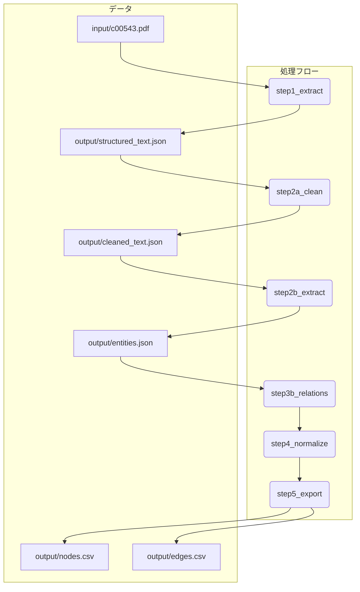

# med-graph-gen

## **はじめに**

`med-graph-gen`は、医学系PDFドキュメント（例：診療ガイドライン）を解析し、そこに含まれる専門用語（疾患、薬剤、治療法など）とその関係性を抽出して、ナレッジグラフ形式のCSVファイル（ノードリストとエッジリスト）を自動生成するツールです。

これにより、人手を介さずに、文献情報から構造化された知識データを構築することを目指します。

## **概要**

本プロジェクトは、提供されたPDFファイル『非歯原性歯痛の診療ガイドライン』から、医学用語の関連性（原因、症状、治療法など）を構造化したナレッジグラフを構築するためのCSVファイルを、人手による注釈なしで自動生成するシステムの実装計画を定義します。

ローカルでの実行環境はDockerコンテナ上に構築し、環境差異による影響を排除し、再現性を担保します。

## **プロジェクト構成**

### **ディレクトリ構造**

```
med-graph-gen/
│
├── build/                  # Dockerビルド関連のファイルを格納
│   ├── Dockerfile
│   └── requirements.txt
│
├── input/
│   └── c00543.pdf          # 入力となるPDFファイル
│
├── output/                 # 生成されたCSVファイルが格納される
│   ├── nodes.csv
│   └── edges.csv
│
└── src/                    # Pythonソースコード
    ├── main.py
    ├── step1_extract.py
    ├── step2a_clean_text.py
    ├── step2b_extract_entities.py
    ├── step3a_rule_based_relations.py
    ├── step3b_llm_based_relations.py
    ├── step4_normalize.py
    └── step5_export.py
```

### **処理フロー**



## **開発環境**

コンテナの構成は `build/Dockerfile` と `build/requirements.txt` を参照してください。

## **実装ステップ**

処理は以下のステップに分割し、それぞれを独立したPythonモジュールとして実装します。

### **ステップ1: テキスト抽出 (step1_extract.py)**

*   **目的:** PDFから指定されたページ範囲のテキストを抽出します。
*   **使用ライブラリ:** PyMuPDF
*   **処理フロー:**
    1.  `input/c00543.pdf` を読み込みます。
    2.  指定された範囲のページからテキストを抽出します。（現在は検証のため`12-22`ページに固定）
    3.  抽出したテキストをページ番号と共に `output/structured_text.json` に保存します。

### **ステップ2a: テキストクレンジングと段落化 (step2a_clean_text.py)**

*   **目的:** ページ単位のテキストを連結し、段落に分割します。その後、LLMを用いて各段落から医学的に無関係な情報を除去し、クレンジングされた段落と元の出典ページ番号のペアを作成します。
*   **使用ライブラリ:** google-generativeai
*   **処理フロー:**
    1.  `output/structured_text.json` を読み込み、全テキストを連結します。
    2.  テキストを段落に分割し、各段落がどのページに由来するかの情報を保持します。
    3.  段落のリストをバッチ化し、LLMに送信して不要な情報を除去します。
    4.  クレンジングされた段落と、その出典ページ番号のリストを `output/cleaned_text.json` に保存します。
        *   **形式:** `[{"paragraph": "...", "source_pages": [12, 13]}, ...]`

### **ステップ2b: LLMによるエンティティ抽出 (step2b_extract_entities.py)**

*   **目的:** クレンジングされた段落から、LLMを用いて医学用語を抽出し、出典ページ番号を紐付けます。
*   **使用ライブラリ:** google-generativeai
*   **処理フロー:**
    1.  `output/cleaned_text.json` を読み込みます。
    2.  段落をバッチ化し、LLMに送信して`Disease`, `Symptom`, `Drug`, `Treatment`等のエンティティを抽出します。
    3.  抽出した各エンティティに、そのエンティティが出現した段落の出典ページ番号を紐付けます。
    4.  重複を除いたユニークなエンティティのリストを `output/entities.json` に保存します。
        *   **形式:** `[{"term": "...", "category": "...", "source_pages": [12]}, ...]`

### **ステップ3b: LLMベースのリレーション抽出 (step3b_llm_based_relations.py)**

*   **目的:** ルールベースでは捉えきれない、より複雑で多様な関係性をLLMを用いて抽出します。
*   **使用ライブラリ:** google-generativeai
*   **処理フロー:**
    1.  `output/cleaned_text.json` と `output/entities.json` を読み込みます。
    2.  段落内のエンティティペアを抽出し、`ENTITY_PAIR_BATCH_SIZE`で指定された数ごとにバッチ化します。
    3.  各バッチをLLMに送信し、エンティティ間の関係を抽出します。
    4.  抽出された関係は、`output/relations.jsonl`に逐次書き込まれます。
        *   **形式:** `{"source": "...", "target": "...", "relation": "...", "reason": "...", "source_pages": [...]}` (JSON Lines形式)
    5.  APIレート制限を考慮し、`DELAY_SECONDS`で指定された秒数だけ待機します。

### **ステップ4: ナレッジの正規化 (step4_normalize.py)**

*   **目的:** 抽出したエンティティの表記ゆれ（略語など）を統一します。
*   **使用ライブラリ:** pandas
*   **処理フロー:** （今後の実装）

### **ステップ5: CSVへのエクスポート (step5_export.py)**

*   **目的:** 最終的なノードとエッジのリストをCSVファイルとして出力します。
*   **使用ライブラリ:** pandas
*   **処理フロー:** （今後の実装）

## **前提条件**

*   [Docker](https://www.docker.com/) がインストールされていること。
*   Gemini APIキーが取得済みであること。

## **実行手順**

1.  **Gemini APIキーの設定:**
    プロジェクトのルートディレクトリに `.env` ファイルを作成し、APIキーを記述します。

2.  **Dockerイメージのビルド:**
    ```bash
    docker build -t knowledge-graph-builder .
    ```

3.  **Dockerコンテナの実行:**
    *   **全ステップを実行:**
        ```bash
        docker run --rm -v /mnt/d/local_envs/med-graph-gen/output:/app/output --env-file .env knowledge-graph-builder
        ```
    *   **特定のステップから実行:**
        `--start-step`引数で開始ステップを指定できます。（例: `step3b`から開始）
        `relation_extraction_batch_prompt.md`をマウントし、`python -u`で非バッファモードで実行します。
        ```bash
        docker run --rm -v /mnt/d/local_envs/med-graph-gen/output:/app/output \
          -v /mnt/d/local_envs/med-graph-gen/relation_extraction_batch_prompt.md:/app/relation_extraction_batch_prompt.md \
          --env-file .env knowledge-graph-builder python -u src/main.py --start-step step3b
        ```

    実行が完了すると、ローカルの `output` ディレクトリに中間ファイルや最終的なCSVが生成されます。

## **（参考）生成される中間ファイルの形式**

**output/cleaned_text.json**
```json
[
  {
    "paragraph": "クレンジングされた段落1...",
    "source_pages": [12]
  },
  {
    "paragraph": "クレンジングされた段落2...",
    "source_pages": [12, 13]
  }
]
```

**output/entities.json**
```json
[
  {
    "term": "非歯原性歯痛",
    "category": "Disease",
    "source_pages": [12, 13]
  }
]
```

**output/relations.jsonl**
```jsonl
{"source": "エンティティA", "target": "エンティティB", "relation": "関係タイプ", "reason": "理由", "source_pages": [12]}
{"source": "エンティティC", "target": "エンティティD", "relation": "関係タイプ", "reason": "理由", "source_pages": [13]}
```

## **生成されるCSVの例**

**output/nodes.csv**

```csv
NodeID,Label,Category
DISEASE_001,非歯原性歯痛,疾患
DISEASE_002,筋・筋膜痛,疾患
DRUG_001,カルバマゼピン,薬剤
TREATMENT_001,抜髄,治療法
```

**output/edges.csv**

```csv
SourceID,TargetID,Relation,DataSource
DISEASE_001,DISEASE_002,has_underlying_disease,c00543.pdf_p12
DRUG_001,DISEASE_001,is_effective_for,c00543.pdf_p40
TREATTMENT_001,DISEASE_001,is_not_effective_for,c00543.pdf_p49
```